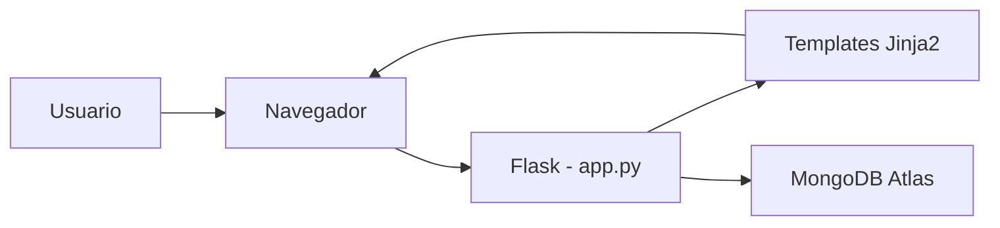

# Documento Tecnico - Abarrotes ABBA

## 1. Informacion general

**Nombre del proyecto:** Abarrotes ABBA  
**Tipo de sistema:** Aplicacion web para gestion de tienda de abarrotes  
**Objetivo:** Administrar productos, controlar inventario y permitir que clientes realicen pedidos mediante una interfaz web conectada a MongoDB.

El proyecto fue desarrollado con fines academicos para aplicar conceptos de desarrollo web, bases de datos NoSQL, operaciones CRUD, manejo de sesiones y separacion basica entre roles de usuario.

## 2. Tecnologias utilizadas

| Capa | Tecnologia | Uso principal |
| --- | --- | --- |
| Backend | Python | Lenguaje principal del servidor |
| Backend | Flask | Framework web para rutas, sesiones y renderizado |
| Base de datos | MongoDB Atlas | Almacenamiento de usuarios, productos y pedidos |
| Conexion BD | PyMongo | Cliente de conexion entre Flask y MongoDB |
| Variables de entorno | python-dotenv | Carga de credenciales desde archivo `.env` |
| Frontend | HTML5, CSS3 | Estructura y estilos de las vistas |
| Plantillas | Jinja2 | Renderizado dinamico de datos desde Flask |

## 3. Estructura del proyecto

```text
Proyecto/
|-- app.py
|-- requirements.txt
|-- README.md
|-- .env
|-- .gitignore
|-- models/
|   `-- conexion.py
|-- templates/
|   |-- index.html
|   |-- login.html
|   |-- clienteVista.html
|   |-- carrito.html
|   |-- misPedidos.html
|   |-- pedidoExitoso.html
|   |-- inventarioVista.html
|   |-- nuevoProducto.html
|   |-- editarProducto.html
|   `-- verPedidos.html
`-- static/
    |-- css/
    `-- img/
```

## 4. Arquitectura general

La aplicacion sigue una arquitectura web monolitica simple:

1. El usuario interactua con paginas HTML renderizadas desde Flask.
2. Flask recibe las solicitudes HTTP mediante rutas definidas en `app.py`.
3. Las rutas consultan o modifican datos en MongoDB usando el objeto `db`.
4. MongoDB almacena la informacion en colecciones documentales.
5. Flask renderiza plantillas Jinja2 con los datos obtenidos.



## 5. Modulos principales

### 5.1 `app.py`

Archivo principal de la aplicacion. Contiene:

- Inicializacion de Flask.
- Configuracion de la clave de sesion.
- Rutas publicas y protegidas.
- Logica de autenticacion.
- Gestion del carrito en sesion.
- CRUD de productos.
- Registro y consulta de pedidos.
- Actualizacion del estado de pedidos.

### 5.2 `models/conexion.py`

Centraliza la conexion con MongoDB:

- Carga variables de entorno con `load_dotenv()`.
- Obtiene la cadena de conexion desde `MONGO_URI`.
- Crea el cliente `MongoClient`.
- Selecciona la base de datos `abarrotes`.

### 5.3 `templates/`

Contiene las vistas HTML del sistema. Flask envia datos a estas plantillas para mostrar productos, pedidos, formularios y pantallas de confirmacion.

### 5.4 `static/`

Contiene recursos estaticos:

- Hojas de estilo CSS por pantalla.
- Imagenes de productos.

## 6. Roles del sistema

### Cliente

El cliente puede:

- Iniciar sesion.
- Ver productos disponibles.
- Agregar productos al carrito.
- Confirmar pedidos.
- Consultar sus pedidos.
- Cerrar sesion.

### Vendedor

El vendedor puede:

- Iniciar sesion.
- Ver inventario.
- Crear productos.
- Editar productos.
- Eliminar productos.
- Ver pedidos realizados por clientes.
- Cambiar el estado de un pedido a `Entregado`.

## 7. Modelo de datos

La base de datos usada por el sistema es `abarrotes`.

### 7.1 Coleccion `usuarios`

Representa las cuentas que pueden ingresar al sistema.

```json
{
  "_id": "ObjectId",
  "usuario": "julio",
  "contraseña": "1234",
  "rol": "cliente"
}
```

Campos principales:

| Campo | Tipo | Descripcion |
| --- | --- | --- |
| `_id` | ObjectId | Identificador unico generado por MongoDB |
| `usuario` | String | Nombre de usuario para iniciar sesion |
| `contraseña` | String | Clave de acceso |
| `rol` | String | Define si el usuario es `cliente` o `vendedor` |

### 7.2 Coleccion `productos`

Almacena los productos disponibles en la tienda.

```json
{
  "_id": "ObjectId",
  "nombre": "Arroz",
  "categoria": "Abarrotes",
  "precio": 4.5,
  "stock": 100,
  "descripcion": "Bolsa de arroz",
  "imagen": "arroz.jpg"
}
```

Campos principales:

| Campo | Tipo | Descripcion |
| --- | --- | --- |
| `_id` | ObjectId | Identificador unico del producto |
| `nombre` | String | Nombre comercial del producto |
| `categoria` | String | Categoria a la que pertenece |
| `precio` | Number | Precio unitario |
| `stock` | Number | Cantidad disponible |
| `descripcion` | String | Detalle del producto |
| `imagen` | String | Nombre del archivo de imagen |

### 7.3 Coleccion `pedidos`

Registra las compras confirmadas por clientes.

```json
{
  "_id": "ObjectId",
  "id_cliente": "ObjectId en formato string",
  "usuario_cliente": "julio",
  "estado": "Pendiente",
  "productos": [
    {
      "id_producto": "ObjectId en formato string",
      "nombre": "Arroz",
      "precio": 4.5,
      "cantidad": 2
    }
  ],
  "total": 9.0
}
```

Campos principales:

| Campo | Tipo | Descripcion |
| --- | --- | --- |
| `_id` | ObjectId | Identificador unico del pedido |
| `id_cliente` | String | Identificador del cliente que realizo el pedido |
| `usuario_cliente` | String | Nombre de usuario del cliente |
| `estado` | String | Estado del pedido, inicialmente `Pendiente` |
| `productos` | Array | Lista de productos incluidos |
| `total` | Number | Total monetario del pedido |

## 8. Rutas del sistema

| Ruta | Metodo | Funcion | Descripcion |
| --- | --- | --- | --- |
| `/` | GET | `iniciar` | Muestra la pagina inicial |
| `/login` | GET, POST | `login` | Muestra formulario e inicia sesion |
| `/logout` | GET | `logout` | Limpia la sesion del usuario |
| `/clienteVista` | GET | `clienteVista` | Muestra catalogo de productos al cliente |
| `/agregar_carrito/<id_producto>` | GET | `agregar_carrito` | Agrega una unidad del producto al carrito |
| `/carrito` | GET | `carrito` | Muestra productos agregados y total |
| `/confirmarPedido` | GET | `confirmarPedido` | Registra pedido y descuenta stock |
| `/misPedidos` | GET | `misPedidos` | Lista pedidos del cliente actual |
| `/inventarioVista` | GET | `inventarioVista` | Muestra inventario para vendedor |
| `/nuevoProducto` | GET, POST | `nuevoProducto` | Crea un nuevo producto |
| `/editarProducto/<id>` | GET, POST | `editarProducto` | Edita informacion de un producto |
| `/eliminarProducto/<id>` | GET | `eliminarProducto` | Elimina un producto |
| `/verPedidos` | GET | `verPedidos` | Muestra todos los pedidos al vendedor |
| `/cambiarEstado/<id>` | GET | `cambiarEstado` | Cambia un pedido a `Entregado` |

## 9. Flujos principales

### 9.1 Inicio de sesion

1. El usuario abre `/login`.
2. Ingresa usuario y contraseña.
3. Flask busca coincidencia en `db.usuarios`.
4. Si existe, guarda en sesion:
   - `id_usuario`
   - `usuario`
   - `rol`
5. Si el rol es `cliente`, redirige a `/clienteVista`.
6. Si el rol es `vendedor`, redirige a `/inventarioVista`.

### 9.2 Compra de productos

1. El cliente visualiza productos en `/clienteVista`.
2. Selecciona `Agregar al carrito`.
3. El sistema guarda el producto en `session["carrito"]`.
4. El cliente revisa el carrito en `/carrito`.
5. Al confirmar, el sistema:
   - Calcula el total.
   - Descuenta stock en `productos`.
   - Inserta el pedido en `pedidos`.
   - Vacia el carrito.
6. Muestra la pantalla de pedido exitoso.

### 9.3 Gestion de inventario

1. El vendedor ingresa a `/inventarioVista`.
2. Puede consultar productos registrados.
3. Puede crear productos desde `/nuevoProducto`.
4. Puede editar productos desde `/editarProducto/<id>`.
5. Puede eliminar productos desde `/eliminarProducto/<id>`.

### 9.4 Gestion de pedidos

1. El vendedor ingresa a `/verPedidos`.
2. El sistema lista pedidos de todos los clientes.
3. El vendedor puede marcar un pedido como entregado.
4. La ruta `/cambiarEstado/<id>` actualiza el campo `estado`.

## 10. Configuracion y ejecucion

### 10.1 Requisitos previos

- Python instalado.
- Acceso a MongoDB Atlas.
- Archivo `.env` con la variable `MONGO_URI`.

### 10.2 Instalacion

```bash
python -m venv venv
venv\Scripts\activate
pip install -r requirements.txt
```

### 10.3 Variable de entorno

El archivo `.env` debe contener:

```env
MONGO_URI=tu_cadena_de_conexion_mongodb
```

### 10.4 Ejecucion

```bash
python app.py
```

La aplicacion queda disponible en:

```text
http://127.0.0.1:5000
```

## 11. Reglas de negocio identificadas

- Un usuario solo puede ingresar si existe una coincidencia exacta de usuario y contraseña.
- El rol define la pantalla principal despues del inicio de sesion.
- El carrito se almacena temporalmente en la sesion del navegador.
- Si un producto ya existe en el carrito, se incrementa su cantidad.
- Al confirmar un pedido, se descuenta el stock de cada producto comprado.
- Todo pedido nuevo se registra con estado `Pendiente`.
- El vendedor puede cambiar el estado de un pedido a `Entregado`.

## 12. Consideraciones tecnicas

- Las contraseñas actualmente se comparan en texto plano. Para un entorno real se recomienda almacenar hashes seguros.
- Algunas rutas de vendedor no validan explicitamente el rol antes de ejecutar acciones. Se recomienda agregar proteccion por rol.
- La confirmacion de pedidos descuenta stock sin validar si existe cantidad suficiente antes de actualizar.
- El sistema no registra fecha de creacion del pedido. Agregar un campo `fecha` facilitaria reportes e historial.
- La eliminacion de productos se ejecuta mediante una ruta GET. Para mayor seguridad deberia realizarse con POST o DELETE.
- La clave secreta de Flask esta escrita directamente en `app.py`; se recomienda moverla a una variable de entorno.
- El carrito depende de la sesion, por lo que no persiste entre navegadores o dispositivos.

## 13. Posibles mejoras

- Implementar validacion de roles mediante decoradores.
- Agregar cifrado de contraseñas con Werkzeug.
- Validar stock antes de confirmar pedidos.
- Agregar fecha y hora a cada pedido.
- Crear filtros funcionales por categoria y buscador de productos.
- Permitir actualizar cantidades o eliminar productos desde el carrito.
- Agregar mensajes visuales de error y confirmacion.
- Incorporar pruebas unitarias para rutas principales.
- Separar rutas por modulos usando Blueprints de Flask.

## 14. Conclusion

Abarrotes ABBA es una aplicacion web funcional para la gestion basica de una tienda, con separacion de roles entre cliente y vendedor. El sistema cubre operaciones esenciales como autenticacion, visualizacion de productos, gestion de inventario, carrito de compras y administracion de pedidos.

Desde el punto de vista tecnico, el proyecto cumple con una arquitectura clara y sencilla basada en Flask y MongoDB. Para evolucionar hacia un sistema mas robusto, las prioridades recomendadas son mejorar seguridad, validaciones de stock, control de roles y registro historico de pedidos.
